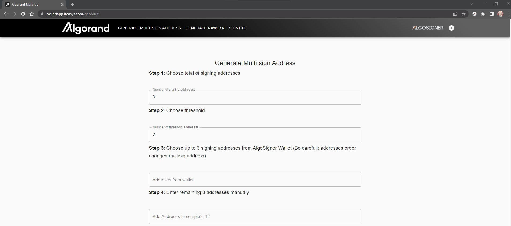

[](https://github.com/nabetse00/Algorand-MultiSig/actions/workflows/go.yml)

[](https://github.com/nabetse00/Algorand-MultiSig/actions/workflows/node.js.yml)

# Algorand Multi-Sig Signer

This repo, includes all of the code necessary to facilitate the signing of multi-signature transactions without exposing SK's.

### Contributors

- [Umar Farooq](https://github.com/UmarFarooq-MP)
- [Ronan Clooney](https://github.com/clooneyr)
- [Owan Hunte](https://github.com/owanhunte)

## Bounty Submission

### Links

- [Live Video Demonstration Loom](https://www.loom.com/share/cae4ef3ad1ba4de0936aba1f4bcbb4af)
- [Live Video Demonstration Youtube](https://youtu.be/vTBiXi2K6M4)
- [Demo frontend ](https://msigdapp.iteasys.com/)
- [Demo backend ](https://msign.iteasys.com/api-doc/index.html)
- [Repo](https://github.com/nabetse00/Algorand-MultiSig)

### Goals

    - Keep PR as close as possible to original fork, so it can serve as a 'Step 2' example
    - Do not get into complicated layers of controller to service to anything...
      This is only useful when you have clear specifications to implement a model,
      which i cannot say i have. So keep it simple...
    - Really perform m of n sign which means some edge cases
    - Good documentation for API
    - No fancy ui just material/react nothing more, nevertheless functional
    - Make a good video and readme so anyone can jump on algorand development
    - Get people to know about algorand
    - And enjoy the variety of SDK at their disposal
    - Have some fun!

### What was done

#### Scripts improvements:

    - Added a script to generate k accounts on testnet
    - Main index.js isn't necessary anymore all done client side

#### User interface improvements

    - Auth on algoSign extension before accessing to any functionality
    - JWT Auth is done by checking a signed txn validity for all accounts in Algosigner (client signs with Algosigner extension)
    - RawTxn is now directly generated inside the browser
    - Two types of RawTxn as examples: NFT and Payment
    - Addresses taken from algosign wallet
    - Show Broadcasted Txn information for AlgoSigner wallet accounts

#### Back-end improvements

    - Added m of n capabilities (includes m of 1)
    - Added mprams to the database
    - Added API documentation + swagger ui
    - Checks txn before adding to db
    - CSRF protection
    - Rate limiter for ddos
    - JWT Auth token from signed txn (client signs with Algosigner)

#### UI Screenshots

- landing page

- MultSign address generation page

- Raw transaction

- Txn Signer


## Design Flow

### Step 1 
- User A and User B share some public addresses to generate a multisign
address. 
- They send some funds to this address
- User A creates in frontend app an asset (NFT, Payment ...) with multisign address and msig data as a RawTxn (Unsigned)
- frontend app sends to backend service the RawTxn, and msig parameters


### Step 2
- User A and B query RawTxn from backend and start signing from frontend
- they send those SignedTxn to the backend


### Step 3
- Once the msig threshold condition is met the backend server 
merges SignedTxns and broadcast it to algorand blockchain
- Backend informs User A and B and they can consult the transaction 
on the blockchain (if it hasn't failed)


## Set-up guide

### Backend

Configuration file is backend\config\config.go
Change  PsToken value to your purestake api key

```go
PsToken  = "PureStakeApiKey"
```

```console
$ cd backend
$ go mod tidy
$ go run ./cmd/main.go
```

After the above commands have been executed you will have the backend service running on localhost:8081

Now you will have access to the following endpoints:

- http://localhost:8081/ms-multisig-db/v1/addrawtxn
- http://localhost:8081/ms-multisig-db/v1/getrawtxn?id=
- http://localhost:8081/ms-multisig-db/v1/addsignedtxn 
- http://localhost:8081/ms-multisig-db/v1/getsignedtxn?id=
- http://localhost:8081/ms-multisig-db/v1/getallsignedtxn?id=
- http://localhost:8081/ms-multisig-db/v1/gettxnids?addr=

Futher documentation of the following endpoints is avaible from
swagger-ui url: http://localhost:8081/api-doc/index.html

You can also consult directly swagger files from backend/docs folder


### Frontend

```console
cd frontend
npm i or npm install
```

head to .\config\config.json and update the X-API-Key key-pair with your purestake api key.
```json
{
  "MSIG_END_POINT_URL": "http://localhost:8081",
  "AUTH_END_POINT_URL": "http://localhost:8081",
  "PS_TOKEN": "your X-API purestake api key here"
}
```

```
npm start
```

After the above commands have been executed you will have the frontend running on localhost:3000

### AlgorandSDK scripts

```console
$ cd algo-scripts
$ npm i or npm install
```

Create a .env file and store your purestake api in the following format

```
PURESTAKE_API_TOKEN='example'
```